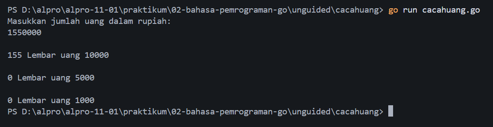
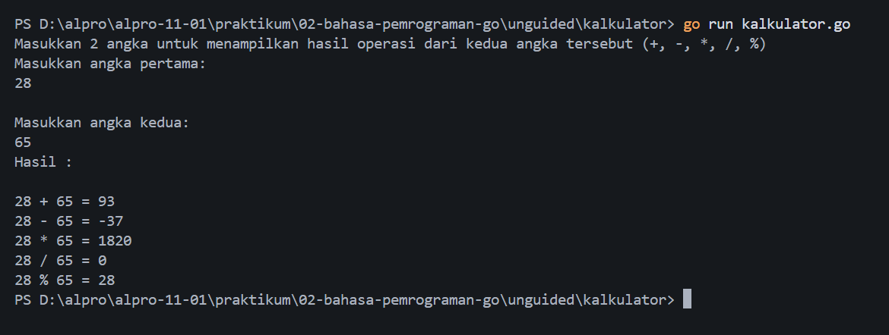

# <h1 align="center">Laporan Praktikum Modul 02 - Bahasa Pemrograman Go</h1>
<p align="center">Muhamad Nawaf Abduh - 109092630003</p>

## Dasar Teori

Modul ini membahas hal-hal dasar dari bahasa Go. Berikut adalah beberapa hal yang dibahas pada modul ini :
- Struktur Pemrograman Go
- Koding, kompilasi, dan eksekusi program Go
- Tipe data dan deklarasi variabel di Go

### A. Struktur Pemrograman Go
program Go harus disimpan dalam format teks dengan ekstensi *.go
Menurut modul praktikum, dalam sebuah kerangka program utama bahasa Go, terdapat dua komponen wajib untuk program Go utama nya, yaitu :

1. `package main`
2. `func main()`

#### 1. `package main`
Menurut modul praktikum
```go
package main
```
merupakan penanda bahwa file ini berisi program utama.

```package main``` memberi tahu Go bahwa file ini adalah program yang dapat di jalankan / executable.
Go kemudian mencari ```func main()``` di dalam file tersebut untuk mengetahui program mana yang akan dieksekusi. Sumber : https://medium.com/@pankajsharma1525/starting-go-001-what-is-package-main-37574b7705d5

#### 2. `func main()`
```go
func main() {
    //
}
```
Adalah sebagai titik awal dari program Go yang akan di eksekusi ketika program Go dijalankan. Fungsi ini akan otomatis dijalankan saat program dimulai. Sumber : https://www.geeksforgeeks.org/go-language/main-and-init-function-in-golang/
<br>```func main()``` harus didefinisikan berada di dalam ```package main``` supaya dapat di eksekusi. Contoh :

<br> Nama file: hello-world.go <br/>

```go
package main 

import "fmt"

func main() {
    fmt.Println("Hello World!")
}
```

### B. Koding, Kompilasi, dan Eksekusi Program Go
1. Koding
    - Program Go harus dibuat menggunakan text editor
    - Setiap program Go disimpan dalam file teks dengan ekstensi ```*.go```. 
    - Setiap satu program Go disimpan dalam satu folder tersendiri. Nama folder merupakan nama program tersebut. Satu program Go dapat dipecah-pecah menjadi beberapa bagian/file namun harus tetap disimpan dalam folder yang sama.

2. Kompilasi
<br>Go diimplementasikan sebagai Kompilator. Kompilator akan memeriksa keseluruhan sumber kode kemudian mengubahnya menjadi program yang dapat dijalankan (executable) dan akan menghasilkan file ```.exe``` pada OS windows. Kita dapat mengkompilasi program Go dengan cara:
	- Buka terminal
	- Masuk ke direktori folder tempat program Go disimpan
	- jalankan perintah ```go build``` atau ```go build nama_file.go```.

    Beberapa perintah bawaan utilitas Go antara lain: 
        <br>```go build``` : mengkompilasi program sumber dalam folder sehingga menjadi file yang executable
        <br>```go build nama_file.go``` : untuk mengkompilasi program Go pada file spesifik
        <br>```go fmt``` : mereformat program sumber agar sesuai dengan standar penulisan program sumber Go
	<br>```go clean```: digunakan untuk menghapus file hasil kompilasi tertentu seperti hasil build yang sudah tidak  diperlukan lagi


### C. Tipe Data dan Deklarasi Variabel di Go

#### 1. Tipe Data

- Integer / Bilangan bulat
    - `int`,
    - `int8`, `int16`, `int32`, dan `int64`, tipe data bilangan bulat yang memiliki ukuran spesifiknya masing-masing.
    - `uint`, `uint8`, `uint16`, `uint32`, dan `uint64`, Unsigned Interger. Merupakan tipe data bilangan bulat yang tidak mempunyai bilangan negatif. Tipe ini hanya dapat menyimpan bilangan nol dan positif.
    - `byte`, alias dari `uint8`,
    - `rune`, alias dari `int32`,

- Tipe data bilangan pecahan
    - `float32`, 32 bit
    - `float64`, 64 bit

- Boolean
    - `bool`, tipe data yang hanya memiliki nilai `true` dan `false`.

- Teks
    - `string`, Merupakan tipe data teks. digunakan untuk menyimpan kumpulan karakter atau teks. `string` ditandai dengan tanda petik ganda `"..."`.

#### 2. Deklarasi Variabel

Variabel merupakan wadah untuk menyimpan data yang nilainya dapat digunakan atau diubah selama program berjalan. Deklarasi variabel di Go, dapat menggunakan kata kunci `var`. Cara penulisan:

```go
var namaVariabel tipeData
```

di Go kita juga dapat langsung memberikan nilai pada variabel saat dideklarasikan:

```go
var angka int = 10
```

di Go, kita juga dapat mendeklarasi kan beberapa variabel sekaligus. Contohnya sebagai berikut:

```go
var a, b int
```

Dengan seperti itu, kode nya terlihat lebih rapih

Variabel juga dapat dideklarasikan dengan bentuk singkat menggunakan `:=`. Pada bentuk ini, tipe data ditentukan secara otomatis oleh Go berdasarkan nilai yang diberikan di dalam variabel nya.

```go
angka := 10       // Go otomatis membaca variabel ini bertipe int
pesan := "Halo"   // Go otomatis membaca variabel ini bertipe string
```


## Guided

### 1. lingkaran.go
 
```go
package main

import "fmt"

func main() {
	phi := 3.14

	var (
		r, luas float64
	)

	// Input
	fmt.Print("Masukkan jari-jari lingkaran: ")
	fmt.Scanln(&r)

	// Operasi
	luas = phi * r * r

	// Output
	fmt.Println(luas)
}
```
#### Deskripsi
`lingkaran.go` merupakan tugas Guided untuk membuat program penghitung luas lingkaran. kita inisialisasi variabel phi terlebih dahulu dengan nilai 3.14.
```go
	phi := 3.14
```
Deklarasi variabel
```go
var (
		r, luas float64
	)
```
Proses Input supaya program dapat menerima nilai dari variabel `r` (jari-jari)
```go
	fmt.Print("Masukkan jari-jari lingkaran: ")
	fmt.Scanln(&r)
```
Hitung luas dan simpan hasil operasinya ke dalam variabel luas
```go
    // Operasi
	luas = phi * r * r
```
Hasilnya / Outputnya merupakan luas yang telah terhitung
```go
    // Output
	fmt.Println(luas)
```

### 2. skor.go

```go
package main

import "fmt"

func main() {
	var (
		nama string
		skorBahasaInggris, skorMatematika int
		rataRata int
	)

	// Membaca input dari pengguna
	fmt.Scanln(&nama)
	fmt.Scanln(&skorBahasaInggris)
	fmt.Scanln(&skorMatematika)

	// Operasi
	totalSkor := skorBahasaInggris + skorMatematika
	rataRata = (totalSkor) / 2

	// Output
	fmt.Println(nama)
	fmt.Println(totalSkor)
	fmt.Println(rataRata)
}

```
#### Deskripsi
`skor.go` merupakan tugas Guided untuk membuat program pengolah nilai seorang mahasiswa atau siswa. Pertama, saya deklarasikan variabel `nama` bertipe `string`, kemudian variabel `skorBahasaInggris`, `skorMatematika`, dan `rataRata` bertipe `int`.
```go
var (
	nama string
	skorBahasaInggris, skorMatematika int
	rataRata int
)
```
Program kemudian menerima input berupa nama, skor Bahasa Inggris, dan skor Matematika.
```go
fmt.Scanln(&nama)
fmt.Scanln(&skorBahasaInggris)
fmt.Scanln(&skorMatematika)
```
Setelah itu, kedua skor dijumlahkan dan disimpan ke dalam variabel `totalSkor`. `totalSkor` kemudian dibagi dua untuk mendapatkan nilai rata-rata nya.
```go
totalSkor := skorBahasaInggris + skorMatematika
rataRata = totalSkor / 2
```
Hasilnya: Output berupa nama, total skor, dan rata-rata yang telah dihitung, yang ditampilkan menggunakan `fmt.Println`.
```go
fmt.Println(nama)
fmt.Println(totalSkor)
fmt.Println(rataRata)
```

### 3. suhu.go
```go
package main

import "fmt"

func main() {
	var (
		celcius,kelvin,fahrenheit,raemur float64
	)


	// Input
	fmt.Println("Konversi suhu.\n Masukkan suhu dalam satuan Celcius untuk di konversi ke satuan Fahrenheit, Raemur, dan Kelvin")
	fmt.Scanln(&celcius)

	// Konversi suhu
	fahrenheit = celcius * 9 / 5 + 32
	raemur = celcius * 4 / 5
	kelvin = celcius + 273.15

	// Output
	fmt.Print("\n",fahrenheit, raemur, kelvin)
}
```

#### Deskripsi
`suhu.go` merupakan tugas Guided untuk membuat sebuah program yang dapat mengonversi suhu dalam satuan `celsius` ke satuan suhu lainnya. Pertama, deklarasikan variabel `celcius`, `kelvin`, `fahrenheit`, dan `raemur` dengan tipe data `float64` karena hasil konversi dapat berupa bilangan pecahan.
```go
var (
	celcius, kelvin, fahrenheit, raemur float64
)
```
Menginputkan suhu dalam satuan celcius yang ingin kita konversi ke satuan lainnya, lalu nilai dari inputannya akan masuk ke variabel `celcius`.
```go
fmt.Scanln(&celcius)
```
Konversikan nilai celcius ke Fahrenheit, Reamur, dan Kelvin menggunakan rumus konversi masing-masing. Hasil setiap operasi disimpan ke dalam variabel satuan suhunya masing-masing.
```go
fahrenheit = celcius * 9 / 5 + 32
raemur = celcius * 4 / 5
kelvin = celcius + 273.15
```
Hasilnya atau outputnya akan berupa nilai Fahrenheit, Reamur, dan Kelvin (hasil konversi dari celcius), yang ditampilkan menggunakan `fmt.Print`.
```go
fmt.Print("\n", fahrenheit, raemur, kelvin)
```

### 4. tukar.go
```go
package main

import "fmt"

func main() {
	var (
		a int
		b int
	)

	// Input nilai a dan b
	fmt.Print("Masukkan nilai a: ")
	fmt.Scanln(&a)
	fmt.Print("Masukkan nilai b: ")
	fmt.Scanln(&b)

	// Tukar nilai a dan b
	a, b = b, a

	// Output hasil setelah ditukar
	fmt.Println(a)
	fmt.Println(b)
}
```

#### Deskripsi
`tukar.go` merupakan tugas Guided untuk membuat program yang dapat menukar nilai dua variabel. Pertama, deklarasikan variabel `a` dan `b` dengan tipe data `int` karena nilai yang digunakan berupa bilangan bulat.
```go
var (
	a int
	b int
)
```
Proses menginputkan nilai agar program dapat menerima nilai `a` dan `b` dari pengguna.
```go
fmt.Scanln(&a)
fmt.Scanln(&b)
```
Tukarkan nilai `a` ke `b` dan `b` ke `a`.
```go
a, b = b, a
```
Hasilnya atau outputnya berupa nilai `a` dan `b` yang telah ditukar, yang ditampilkan menggunakan `fmt.Println`.
```go
fmt.Println(a)
fmt.Println(b)
```

## Unguided

### 1. Cacah Uang

```go
package main

import "fmt"

func main () {
	var (
		uangRupiah int
		lembar10rb, lembar5rb, lembar1rb int
	)

	// Input
	fmt.Println("Masukkan jumlah uang dalam rupiah: ")
	fmt.Scanln(&uangRupiah)

	// Operasi
	lembar10rb = uangRupiah / 10000 // bagi 10rb
	uangRupiah %= 10000 // sisa setelah dibagi 10rb
	lembar5rb = uangRupiah / 5000 // sisa tadi dibagi 5rb
	uangRupiah %= 5000 // sisa setelah dibagi 5rb
	lembar1rb = uangRupiah / 1000 // sisa tadi dibagi 1rb

	// Output
	fmt.Printf("\n%d Lembar uang 10000\n", lembar10rb)
	fmt.Printf("\n%d Lembar uang 5000\n", lembar5rb)
	fmt.Printf("\n%d Lembar uang 1000\n", lembar1rb)
}
```

##### Output



#### Deskripsi
`Cacah Uang` merupakan tugas Unguided untuk membuat program yang menghitung jumlah lembar uang pecahan Rp10.000, Rp5.000, dan Rp1.000 dari jumlah uang yang diinputkan.

Deklarasi variabel : 
- `uangRupiah` variabel yang akan menerima input untuk dihitung jumlah lembar pecahan uang nya, 
- `lembar10rb`, `lembar5rb`, dan `lembar1rb` merupakan variabel pecahan uang nya. 
- semua variabel diatas menggunakan tipe data `int`
```go
var (
	uangRupiah, lembar10rb, lembar5rb, lembar1rb int
)
```
Kemudian masukkan jumlah uang yang ingin dihitung jumlah lembar pada masing-masing pecahannya.
```go
fmt.Scanln(&uangRupiah)
```
Jumlah lembar setiap pecahan dihitung secara berurutan. Hitung jumlah lembar pada masing-masing pecahan dengan membagi `uangRupiah yang diinputkan` dengan `pecahannya`. Setelahnya, sisa dari pembagian sebelumnya (apabila tidak habis) disimpan kembali ke variabel `uangRupiah` menggunakan operator `%=` atau `sisa bagi`. Langkah yang sama dilakukan untuk pecahan lainnya.
```go
lembar10rb = uangRupiah / 10000
uangRupiah %= 10000
lembar5rb = uangRupiah / 5000
uangRupiah %= 5000
lembar1rb = uangRupiah / 1000
```
Hasilnya: Output berupa jumlah lembar untuk masing-masing pecahan (Rp10.000, Rp5.000, dan Rp1.000), yang ditampilkan menggunakan `fmt.Printf`.
```go
fmt.Printf("\n%d Lembar uang 10000\n", lembar10rb)
fmt.Printf("\n%d Lembar uang 5000\n", lembar5rb)
fmt.Printf("\n%d Lembar uang 1000\n", lembar1rb)
```


### 2. Kalkulator

```go
package main
import "fmt"

func main() {
	var (
		a, b int
	)

	// Input
	fmt.Println("Masukkan 2 angka untuk menampilkan hasil operasi dari kedua angka tersebut (+, -, *, /, %) ")
	fmt.Println("Masukkan angka pertama: ")
	fmt.Scanln(&a)

	for {
		fmt.Println("\nMasukkan angka kedua: ")
		fmt.Scanln(&b)

		if b == 0 {
			fmt.Println("Angka kedua tidak boleh 0. Silahkan coba lagi! ")
			continue
		}

		break
	}
	
	// Output menggunakan formatting
	// % merupakan placeholder yang akan menampilkan nilai dari argumen setelahnya sesuai urutan
	// d merupakan verb integer yang
	fmt.Println("Hasil :")
	fmt.Printf("\n%d + %d = %d\n", a, b, a+b)
	fmt.Printf("%d - %d = %d\n", a, b, a-b)
	fmt.Printf("%d * %d = %d\n", a, b, a*b)
	fmt.Printf("%d / %d = %d\n", a, b, a/b)
	fmt.Printf("%d %% %d = %d\n", a, b, a%b)	
}
```

##### Output


#### Deskripsi
`Kalkulator` merupakan tugas Unguided untuk membuat program yang menghitung dua bilangan bulat, lalu menampilkan hasil penjumlahan, pengurangan, perkalian, pembagian, dan modulo dari kedua bilangan bulat tersebut.

Deklarasi Variabel :
- `a` dan `b` dengan tipe data `int`
```go
var (
	a, b int
)

```
Pengguna memasukkan bilangan bulat pertama lalu program membaca angka pertama dan menyimpannya ke dalam variabel `a`. 
```go
fmt.Scanln(&a)
```
kemudian pengguna memasukkan bilangan bulat kedua dan menyimpannya ke dalam variabel `b`.
Angka kedua dibaca dan diinputkan di dalam perulangan. Jika `b` bernilai nol, program menampilkan pesan dan akan kembali ke titik awal pengulangan yaitu menginputkan kembali bilangan bulat kedua. Perulangan akan diberhentikan dan program akan tetap berlanjut ketika pengguna memasukkan angka kedua yang bukan nol.
```go
for {
	fmt.Scanln(&b)

	if b == 0 {
		fmt.Println("Angka kedua tidak boleh 0. Silahkan coba lagi! ")
		continue
	}

	break
}
```

Setelah input valid, program menghitung dan menampilkan hasil dari lima operasi aritmetika. `fmt.Printf` menggunakan format `%d` untuk menampilkan bilangan bulat, sedangkan `%%` digunakan agar tanda persen tampil sebagai karakter `%`.
```go
fmt.Printf("%d + %d = %d\n", a, b, a+b)
fmt.Printf("%d - %d = %d\n", a, b, a-b)
fmt.Printf("%d * %d = %d\n", a, b, a*b)
fmt.Printf("%d / %d = %d\n", a, b, a/b)
fmt.Printf("%d %% %d = %d\n", a, b, a%b)
```
Output nya, pengguna dapat melihat hasil dari setiap operasi dari kedua angka yang dimasukkan oleh pengguna sebelumnya

## Kesimpulan

Berdasarkan hasil praktikum dan pembahasan mengenai Bahasa Pemrograman Go pada modul 2, dapat disimpulkan bahwa:

1. Setiap program Go utama wajib dibangun menggunakan 2 komponen utama yaitu `package main` yang menandakan bahwa file ini adalah program yang dapat di jalankan / executable. Dan `func main()` yang berfungsi sebagai titik awal dari program Go yang akan di eksekusi ketika program Go dijalankan

2. Go diimplementasikan sebagai bahasa yang dikompilasi. Kode sumber diperiksa supaya dapat menjadi program yang bisa dijalankan / executable. Kode sumber disimpan dalam format file `*.go` di dalam folder tersendiri dan dikompilasi menggunakan perintah `go build` atau `go build nama_file.go` untuk file spesifik yang akan menghasilkan file executable (`.exe` pada Windows)

3. Penggunaan utilitas seperti `go fmt` dapat digunakan untuk merapikan format kode supaya sesuai standar, sedangkan `go clean` digunakan untuk membersihkan hasil kompilasi.

4. di Go memiliki berbagai tipe data dasar dan tipe data untuk studi kasus spesifik. 

	Tipe data dasar:
	- `int, uint`, `float32`, `float64` tipe data numerik
	- `string` tipe data teks
	- `bool` true dan false

	Tipe data spesifik:
	- `int8`, `int16`, `int32`, `int64`
	- `uint8`, `uint16`, `uint32`, `uint64`
	- dan banyak lagi

	Tipe data spesifik tersebut digunakan untuk studi kasus tertentu 

5. Di Go, kita dapat mendeklarasikan variabel dengan kata kunci `var` dengan mencantumkan nama dan tipe datanya. Contoh:
	```go
	var namaVariable tipeData
	```
	Kita juga dapat mendeklarasikan variabel sekaligus memberikan nilainya menggunakan bentuk singkat `:=`. Dengan bentuk ini, Go menentukan tipe data variabel secara otomatis berdasarkan nilai yang diberikan. Contoh:
	```go
	namaVariable := "String"
	```
	Pada contoh tersebut, Go menentukan bahwa variabel `namaVariable` menggunakan tipe data `string` berdasarkan nilai teks yang diberikan karena terdapata `"..."` sebagai penanda tipe data `string`.

6. Penerapan I/O menggunakan package `"fmt"` [`fmt.Print`, `fmt.Println`, `fmt.Printf`, dan `fmt.Scanln`] Melalui pengerjaan tugas `Guided` [`lingkaran.go`, `skor.go`, `suhu.go`, `tukar.go`] dan `Unguided` [`Cacah Uang` dan `Kalkulator`]. Telah berhasil dipahami dengan baik.

Dari praktikum ini, saya berhasil memahami keseluruhan materi yang diberikan dengan baik 

## Referensi
#### 1. Materi Modul 2 - Pemrograman Bahasa Go

#### 2. Pankaj Sharma. 2026 - Starting Go #001: What is package main?
Sumber: *https://medium.com/@pankajsharma1525/starting-go-001-what-is-package-main-37574b7705d5*
<br>Diakses pada 26 September 2026 melalui https://medium.com/@pankajsharma1525/starting-go-001-what-is-package-main-37574b7705d5

#### 3. Ankita Saini. 2026 - Main and init function in Golang 
Sumber : https://www.geeksforgeeks.org/go-language/main-and-init-function-in-golang/*.
<br>Diakses pada 26 Septeber 2026 melalui https://www.geeksforgeeks.org/go-language/main-and-init-function-in-golang