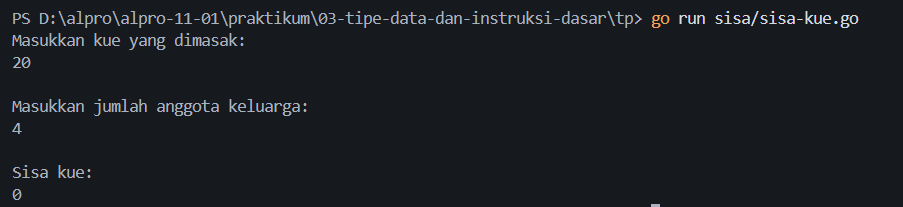
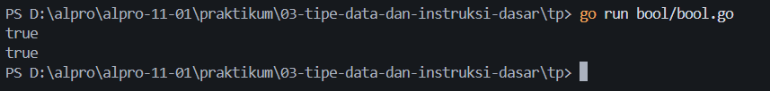
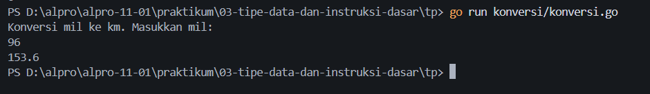

# <h1 align="center">Tugas Pendahuluan Modul 03 - Variabel dan Operator</h1>
<p align="center">Muhamad Nawaf Abduh - 109092630003</p>

### 1. sisa-kue.go

```go
package main

import "fmt"

func main() {
	var (
		kue, anggotaKeluarga, sisaKue int
	)

	fmt.Println("Masukkan kue yang dimasak:")
	fmt.Scanln(&kue)

	fmt.Println("\nMasukkan jumlah anggota keluarga:")
	fmt.Scanln(&anggotaKeluarga)

	fmt.Println("\nSisa kue:")
	sisaKue = kue % anggotaKeluarga 

	fmt.Println(sisaKue)
}
```

##### Output



#### Deskripsi
`sisa-kue.go` merupakan program untuk menghitung berapa banyak `kue yang tersisa` setelah `kue` dibagikan secara sama rata pada `setiap anggota keluarga`.

`sisa kue` dihitung dengan menggunakan operator `%` atau `modulus` 
```go
	sisaKue = kue % anggotaKeluarga 
```

lalu `sisa kue` ditampilkan menggunakan :
```go 
fmt.Println(sisaKue)
```

### 2. bool.go

```go
package main
import "fmt"

func main() {
	var(
		status bool
	)
	
	fmt.Scanln(&status)
	fmt.Println(status)
}
```

##### Output



#### Deskripsi
program `bool.go` merupakan program untuk membaca dan menampilkan nilai status bertipe boolean.

nilai `status` dibaca menggunakan `fmt.Scanln(&status)`
```go
	fmt.Scanln(&status)
```

lalu nilai `status` ditampilkan menggunakan:
```go
fmt.Println(status)
```

### 3. konversi.go
```go
package main
import "fmt"

func main() {
	var(
		mil, km float64
	)

	fmt.Println("Konversi mil ke km. Masukkan mil:")
	fmt.Scan(&mil)
	km = mil * 1.6

	fmt.Printf("%.1f", km)
}
```
##### Output



#### Deskripsi
`konversi.go` merupakan program untuk mengubah jarak dalam satuan mil menjadi kilometer.

nilai kilometer dihitung dengan mengalikan nilai mil dengan `1.6`:
```go
	km = mil * 1.6
```

lalu hasil konversi ditampilkan dengan satu angka di belakang koma menggunakan `fmt.Printf`:
```go
fmt.Printf("%.1f", km)
```

## Kesimpulan
Karena praktikum ini saya dapat lebih memahami bagaimana cara `modulus atau %`, `formatting` menggunakan `Printf` untuk menampilkan variabel bertipe data `float`, dan tipe data `boolean` bekerja.